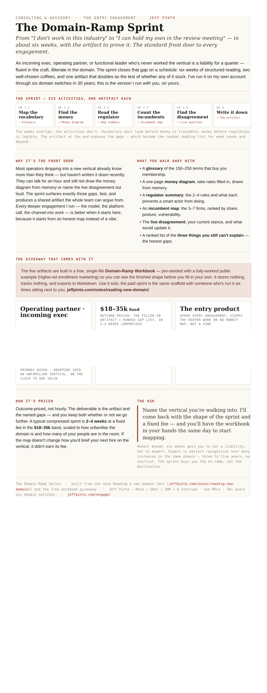

# reading-new-domain

**The workbook for the six-week domain ramp.**

The six-week domain-ramp sprint, turned into a single-file workbook: five artifact builders that take you from outsider to value-adding in an unfamiliar industry, pre-loaded with a worked higher-ed example, with export to Markdown. Nothing you type leaves the page — no server, no storage, no tracking.

## Demo

Open [`workbook.html`](./workbook.html) in any browser — double-clicking the file works. It's a single self-contained HTML file: no server, no build step, no network calls. All state stays in-memory in the tab.

## What else is here

- [`one-pager.html`](./one-pager.html) — the engagement sheet (one Letter page; preview below).
- [`note.html`](./note.html) — the long-form note, rendered for the fleet bundle (its stylesheet lives in the parent bundle, so it opens unstyled here; the canonical version is the source note below).

## Data

Everything in this repo is synthetic or public — no client data, no real metrics, no PII. See [`PRIVACY.md`](./PRIVACY.md).

## Source

The thinking behind this prototype: https://jeffpinto.com/notes/reading-new-domain/

## License

MIT — © 2026 Jeff Pinto.

Built by Jeff Pinto · advisory: https://jeffpinto.com/engage/
